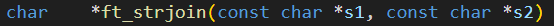
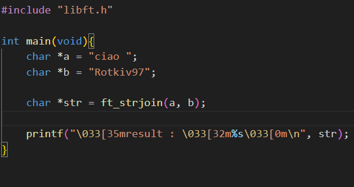
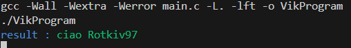

# Introduction Libft

``` 

It's the first project they had us do at 42. 

This project consists of creating a C library.


During the course of this project we face:

    - String manipulation
    - Memory management
    - Byte management
    - Address management
    - A light introduction to structures

```
# [Subject](Libft.subject.pdf) by Libft

# Project tree    
```
├── Libft.subject.pdf
├── Makefile
├── README.md
├── ft_atoi.c
├── ft_bzero.c
├── ft_calloc.c
├── ft_isalnum.c
├── ft_isalpha.c
├── ft_isascii.c
├── ft_isdigit.c
├── ft_isprint.c
├── ft_itoa.c
├── ft_lstadd_back.c
├── ft_lstadd_front.c
├── ft_lstclear.c
├── ft_lstdelone.c
├── ft_lstiter.c
├── ft_lstlast.c
├── ft_lstmap.c
├── ft_lstnew.c
├── ft_lstsize.c
├── ft_memchr.c
├── ft_memcmp.c
├── ft_memcpy.c
├── ft_memmove.c
├── ft_memset.c
├── ft_putchar_fd.c
├── ft_putendl_fd.c
├── ft_putnbr_fd.c
├── ft_putstr_fd.c
├── ft_split.c
├── ft_strchr.c
├── ft_strdup.c
├── ft_striteri.c
├── ft_strjoin.c
├── ft_strlcat.c
├── ft_strlcpy.c
├── ft_strlen.c
├── ft_strmapi.c
├── ft_strncmp.c
├── ft_strnstr.c
├── ft_strrchr.c
├── ft_strtrim.c
├── ft_substr.c
├── ft_tolower.c
├── ft_toupper.c
└── libft.h
```

# How to test the project

1) Open the terminal
2) Go to the folder where the Makefile is located
    >* make
 
3) ## Creates a new main.c file
# Example : here I want to use a function from the ft_strjoin library which takes 2 strings as input and returns a string


# main.c


4) ## commands for out put 

# Output

